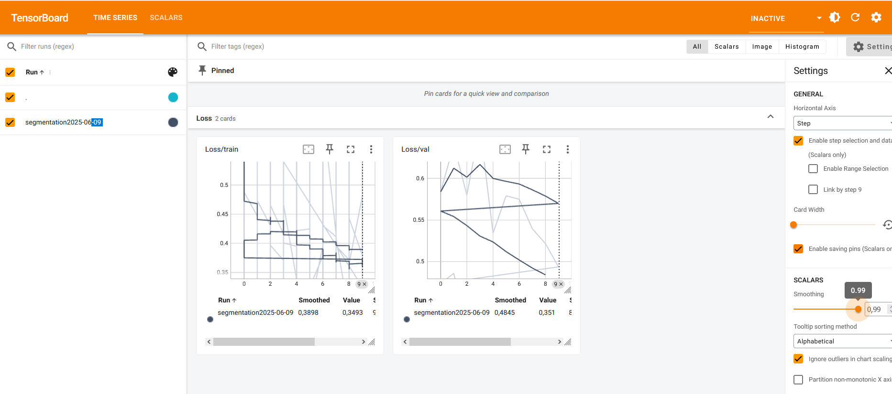
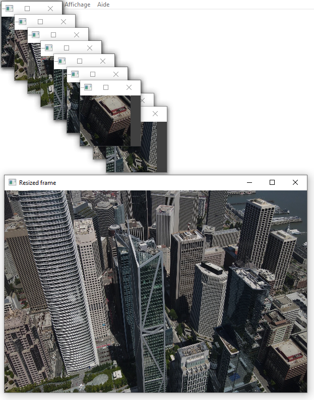

# Farfadet

Developed competences : UNET architecture, pytorch (train, save, load, optimize, monitor with tensorboard), opencv, computing at scale on HD videos

## Ideation
UNET segmentation + inference on videos

- [Corrosion_Rust dataset](https://huggingface.co/datasets/BinKhoaLe1812/Corrosion_Rust) : labels
- [Corrobot dataset](https://universe.roboflow.com/corrosionbot619/corrobot/dataset/2) : segmentation

0. Train 2 models : simple classifier (Corrosion : Yes / NO) and a UNET segmentation mask using the dataset above
Tensorboard monitoring messed up to be fixed

1. Load video
2. Cut each frame in smaller part

3. Apply segmentation on small part
4. Reconstruct the whole frame
5. Display frame result as a layer on the video
6. Build a GUI around the results

## TODO

0. Dockerize everything
1. Load Corrobot dataset in model and train on it
