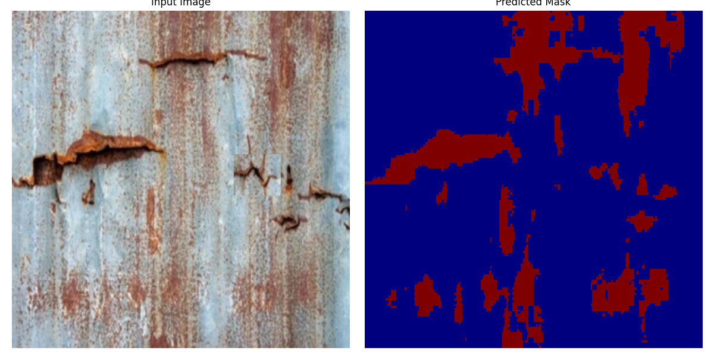

# Farfadet

Developed competences : UNET architecture, pytorch (train, save, load, optimize, monitor with tensorboard), opencv, computing at scale on HD videos

For the moment the UNET model is a look alike UNET model. It does not convey information between the encoder and decoder layers. It should be tried to improve model performance.

## Ideations
UNET segmentation + inference on videos

- [Corrosion_Rust dataset](https://huggingface.co/datasets/BinKhoaLe1812/Corrosion_Rust) : labels
- [Corrobot dataset](https://universe.roboflow.com/corrosionbot619/corrobot/dataset/2) : segmentation

0. Train 2 models : simple classifier (Corrosion : Yes / NO) and a UNET segmentation mask using the dataset above

Tensorboard monitoring messed up to be fixed

0. bis Improve model performance
Here a snippet of how the model performs currently

1. Load video
2. Cut each frame in smaller part

3. Apply segmentation on small part

4. Reconstruct the whole frame
5. Display frame result as a layer on the video
6. Make sure everything runs on GPU

## TODO or Future ideas

0. Dockerize everything
1. Build a GUI around the results
2. Reconstrust a 3D Model
3. Try to use Rust for faster inference on video. Possible to load pytorch model in Rust? We may need to retrain the model.
